# Setup Guide

This guide takes you from a fresh copy of the code to a live investment site on your own domain. Follow the steps in order. Each step tells you where to click and what to type.

When the admin panel is running, open **System > Setup Checklist**. It checks most of these steps for you and links each one back to its step number in this guide.

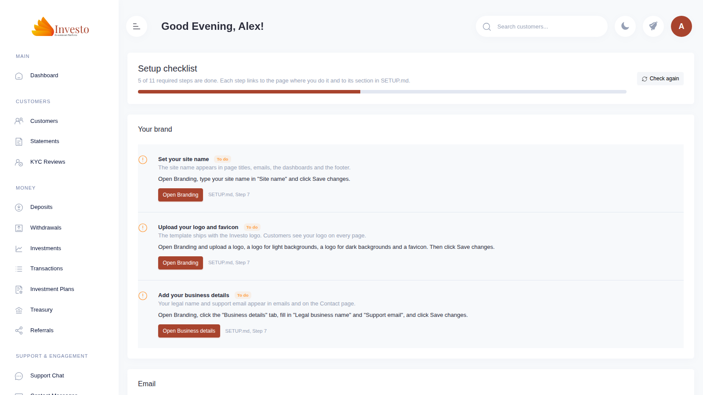

## Contents

1. [Create your accounts](#step-1-create-your-accounts)
2. [Create the database](#step-2-create-the-database)
3. [Deploy the server functions](#step-3-deploy-the-server-functions)
4. [Turn on live prices](#step-4-turn-on-live-prices)
5. [Put the website online and create your admin account](#step-5-put-the-website-online-and-create-your-admin-account)
6. [Invite your team](#step-6-invite-your-team)
7. [Add your brand](#step-7-add-your-brand)
8. [Set up email](#step-8-set-up-email)
9. [Set up payments](#step-9-set-up-payments)
10. [Add plans and markets](#step-10-add-plans-and-markets)
11. [Connect your domain](#step-11-connect-your-domain)
12. [Before you launch](#step-12-before-you-launch)

---

## Step 1: Create your accounts

You need these accounts. All of them have a free plan that is enough to start.

| Account | What it does | Sign up at |
| --- | --- | --- |
| Supabase | Database, logins and server functions | https://supabase.com |
| Vercel | Hosts the website | https://vercel.com |
| Resend | Sends emails | https://resend.com |
| A domain registrar | Your web address, for example `northwind.co` | Any registrar, for example Namecheap or Cloudflare |
| A cloud server (VPS) | Runs PayRam for crypto payments. Only needed for Step 9. | AWS, DigitalOcean, Hetzner or similar |

You also need these programs on your computer:

- **Node.js 20 or newer.** Download it from https://nodejs.org.
- **Supabase CLI.** Install it with `npm install -g supabase`.

---

## Step 2: Create the database

1. Sign in to Supabase and click **New project**.
2. Type a project name, choose a strong database password and pick the region closest to your customers. Save the database password in your password manager. You need it in step 5 of this list.
3. Wait about 2 minutes until the project shows **Healthy**.
4. Open **Project Settings > General** and copy the **Reference ID**. It looks like `abcdefghijklmnopqrst`.
5. Open a terminal in the project folder and run:

   ```bash
   supabase login
   supabase link --project-ref YOUR_REFERENCE_ID
   supabase db push
   ```

   `supabase link` asks for the database password from item 2. `supabase db push` creates all 44 tables, rules and functions from the `supabase/migrations` folder. It takes about 1 minute.

> **Do not run `supabase/seed.sql` on your live project.** It creates test customers and test admins with known passwords. It is only for local testing.

> **Do not use the `supabase/deploy` folder.** It is an old bundle from an earlier version and is missing the latest changes. `supabase db push` replaces it.

---

## Step 3: Deploy the server functions

The server functions send emails, accept admin invites and update live prices. Deploy them from the same terminal:

```bash
supabase functions deploy market-price-sync
supabase functions deploy send-email
supabase functions deploy accept-admin-invite --no-verify-jwt
supabase functions deploy auth-email-hook --no-verify-jwt
```

`--no-verify-jwt` is required for `accept-admin-invite` and `auth-email-hook`. A new admin is not signed in yet when they accept an invite, and Supabase signs the email hook requests in a different way. Both functions check their own security.

To check, open **Edge Functions** in Supabase. You should see 4 functions with the status **Active**.

---

## Step 4: Turn on live prices

Live markets get a new price from CoinGecko every 5 minutes. The timer reads your project address and public key from the Supabase Vault, so you store them there once.

1. In Supabase, open **Project Settings > API**.
2. Copy the **Project URL** (for example `https://abcdefghijklmnopqrst.supabase.co`).
3. Copy the **anon public** key.
4. Open **SQL Editor**, click **New query**, paste the code below, replace the two values and click **Run**:

   ```sql
   select vault.create_secret('https://YOUR_REFERENCE_ID.supabase.co', 'project_url');
   select vault.create_secret('YOUR_ANON_PUBLIC_KEY', 'anon_key');
   ```

To check, wait 5 minutes and run this query:

```sql
select symbol, provider_price, updated_at from market_provider_state
join market_assets on market_assets.id = market_provider_state.asset_id;
```

The `updated_at` time should be less than 5 minutes old. The Setup Checklist shows **Done** for "Live prices are updating" when it is.

---

## Step 5: Put the website online and create your admin account

### 5.1 Deploy on Vercel

1. Upload the project folder to a Git repository that you own.
2. Sign in to Vercel, click **Add New > Project** and import that repository.
3. Leave **Framework Preset** on **Vite**. Leave the build command as `npm run build` and the output folder as `dist`.
4. Open **Environment Variables** and add these 3 variables:

   | Name | Value |
   | --- | --- |
   | `VITE_SUPABASE_URL` | The Project URL from Step 4 |
   | `VITE_SUPABASE_ANON_KEY` | The anon public key from Step 4 |
   | `VITE_APP_ENVIRONMENT` | `production` |

5. Click **Deploy**. The first build takes about 2 minutes.

Your site is now online at an address like `https://your-project.vercel.app`. The admin panel is at `/admin`.

> Never put the Supabase **service_role** key in Vercel. Anyone who opens your site could read it.

### 5.2 Tell Supabase your web address

Sign-up links and password reset links only work if Supabase knows your address.

1. In Supabase, open **Authentication > URL Configuration**.
2. Set **Site URL** to your Vercel address, for example `https://your-project.vercel.app`.
3. Under **Redirect URLs**, add `https://your-project.vercel.app/**`.
4. Click **Save**.

You will change both values to your own domain in Step 11.

### 5.3 Create your super admin account

The site has no admin account yet. You create the first one by hand. After that, you invite every other admin from the admin panel.

1. In Supabase, open **Authentication > Users** and click **Add user > Create new user**.
2. Type your email address and a strong password. Tick **Auto Confirm User**. Click **Create user**.
3. Open **SQL Editor**, paste the code below, replace the email address with yours and click **Run**:

   ```sql
   do $$
   begin
     perform set_config('app.bypass_profile_guard', 'on', true);
     update profiles set role = 'super_admin' where email = 'owner@yourcompany.com';
   end $$;

   select email, role from profiles where email = 'owner@yourcompany.com';
   ```

   The last line must show `super_admin`. If it shows no rows, the email address does not match. Check the spelling and run it again.

### 5.4 Sign in and turn on two-factor authentication

1. Open `https://your-project.vercel.app/admin` and sign in with the email and password from 5.3.

   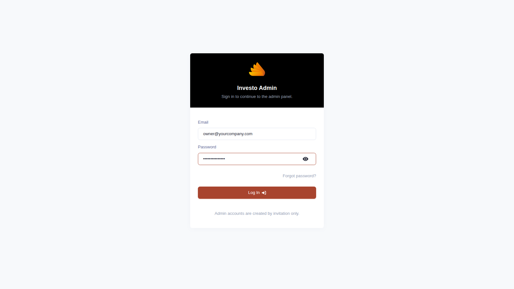

2. Every admin must use two-factor authentication. The panel shows a QR code the first time you sign in. Scan it with Google Authenticator, Microsoft Authenticator or 1Password.
3. Type the 6-digit code from the app and click **Turn on two-factor authentication**.

   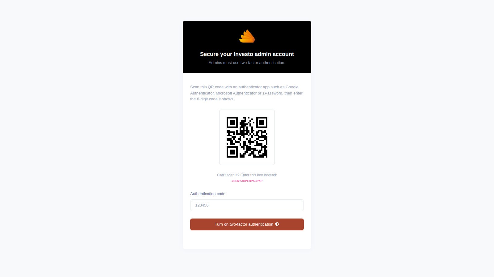

> If you lose your phone, you cannot sign in to the admin panel. To reset it, open **SQL Editor** in Supabase and run the code below with your email address. The next time you sign in, the panel shows a new QR code.
>
> ```sql
> delete from auth.mfa_factors
> where user_id = (select id from auth.users where email = 'owner@yourcompany.com');
> ```

---

## Step 6: Invite your team

1. Open **System > Admins**.
2. Type the person's email address and choose a role:
   - **Super Admin:** everything, including other admins, keys and security settings.
   - **Finance Admin:** deposits, withdrawals and treasury.
   - **Support Admin:** customers, support chat and KYC reviews.
   - **Operations Admin:** plans, markets, announcements and maintenance.
3. Click **Send invite**.

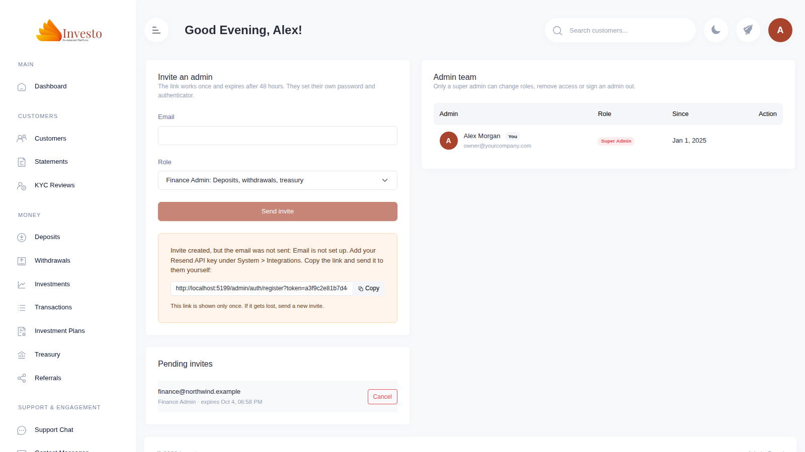

The invite link works once and expires after 48 hours. If email is not set up yet (Step 8), the panel shows the link so you can copy it and send it yourself. The link is shown only once.

Invite at least one more super admin. If you are away or lose access to your email, that person can keep the site running.

---

## Step 7: Add your brand

### 7.1 Name, logo and colors

1. Open **System > Branding**. The **Brand** tab opens.
2. Type your **Site name**. It replaces "Investo" in page titles, emails, the dashboards and the footer.
3. Under **Logos**, upload 4 images:
   - **Logo:** your main logo.
   - **Logo for light backgrounds:** a dark version for white pages.
   - **Logo for dark backgrounds:** a light version for dark pages.
   - **Favicon:** a square image, at least 64 by 64 pixels.
4. Under **Colors**, set your brand colors. The preview box shows how buttons will look.
5. Click **Save changes** at the top right.

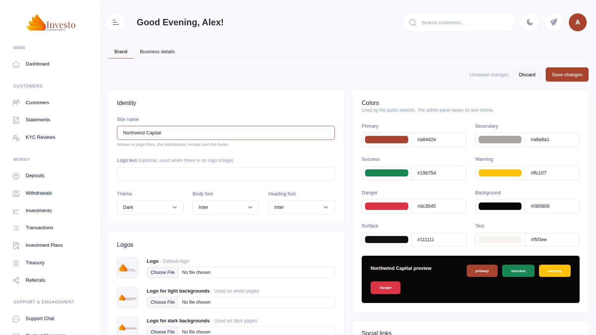

### 7.2 Business details

1. Click the **Business details** tab.
2. Fill in **Legal business name** and **Support email**. These appear in emails and on the Contact page.
3. Fill in the other fields you want customers to see: support phone, address and registration number.
4. Click **Save changes**.

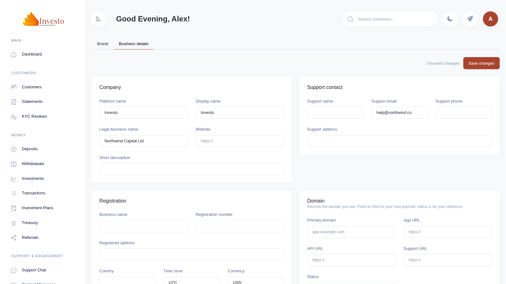

---

## Step 8: Set up email

The site sends emails through Resend: sign-up confirmations, password resets, admin invites and customer statements.

### 8.1 Verify your domain in Resend

1. Sign in to Resend and open **Domains > Add Domain**.
2. Type your domain, for example `northwind.co`.
3. Resend shows 3 or 4 DNS records. Add each one at your domain registrar exactly as shown.
4. Click **Verify DNS Records** in Resend. Verification usually takes 5 to 30 minutes.

### 8.2 Add your Resend key

1. In Resend, open **API Keys > Create API Key**. Give it **Sending access** and click **Add**. Copy the key. It starts with `re_`.
2. In the admin panel, open **System > Integrations** and find the **Email (Resend)** card.
3. Paste the key into **Resend API key**.
4. Set **Send from** to an address on the domain you verified, for example `no-reply@northwind.co`.
5. Set **Sender name** to your site name.
6. Set **Website address** to your site address, for example `https://northwind.co`. Emails use it for links and for your logo.
7. Click **Save**.

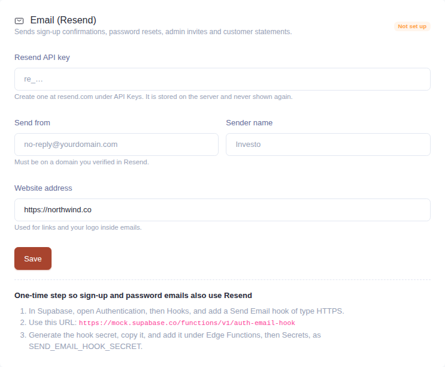

The key is stored on the server. The panel never shows it again. To change it, paste a new key and click **Save**.

### 8.3 Send sign-up and password emails through Resend

Supabase sends only a few sign-up emails per hour on its own, and they do not carry your brand. The email hook sends them through Resend instead.

1. In Supabase, open **Authentication > Hooks** and click **Add hook > Send Email hook**.
2. Choose **HTTPS**.
3. Paste this URL, with your reference ID: `https://YOUR_REFERENCE_ID.supabase.co/functions/v1/auth-email-hook`. The Email (Resend) card in the admin panel shows your exact URL.
4. Click **Generate secret** and copy the secret. It starts with `v1,whsec_`.
5. Click **Create**.
6. Open **Edge Functions > Secrets**, click **Add new secret**, set the name to `SEND_EMAIL_HOOK_SECRET`, paste the secret as the value and click **Save**.

To check, open your site, click **Sign up** and create a test account. The confirmation email should come from your **Send from** address.

The Setup Checklist cannot check this step for you. It shows **Check by hand**.

---

## Step 9: Set up payments

Customers need a way to pay before they can invest. You have 2 options. You can use both.

### Option A: Your own wallet addresses (works now)

Customers see your wallet addresses on the deposit page. They send crypto, and an admin confirms each deposit by hand.

1. Open **System > Integrations** and find the **Wallet addresses for manual deposits** card.
2. Choose **Live** in the list at the top right of the card. (**Demo** is for test deposits.)
3. Paste your receiving address for each coin and network: BTC, ETH (ERC20), USDT (ERC20) and USDT (TRC20).
4. Click outside the box. The address saves on its own.

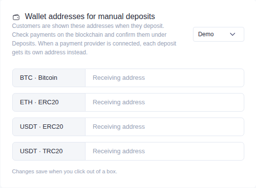

Check every address twice. A payment sent to a wrong address cannot be recovered.

When a customer deposits, the deposit shows in **Money > Deposits** as pending. Check the payment on a blockchain explorer, open the deposit and click **Confirm and credit**. The customer's balance updates at once.

### Option B: PayRam (automatic crypto payments)

PayRam gives every deposit its own address and confirms payments without an admin. PayRam runs on your own server, not on Vercel.

> The PayRam connection is being built now. This section will list the exact steps to create the server, install PayRam and paste its keys into **System > Integrations** when it is ready.

For now, prepare the server:

- **Server size:** 2 vCPUs and 4 GB of memory (for example AWS `t3.medium`).
- **Operating system:** Ubuntu 24.04 LTS.
- **Disk:** 30 GB.
- **Firewall:** allow HTTP (port 80) and HTTPS (port 443) from anywhere. Allow SSH (port 22) only from your own IP address.
- **Fixed IP address:** on AWS, attach an Elastic IP so the address stays the same after a restart.

---

## Step 10: Add plans and markets

### 10.1 Investment plans

1. Open **Money > Investment Plans**. The template includes 3 example plans: Starter, Growth and Professional.
2. Click **Edit** on a plan to change its name, daily rate, minimum and maximum amount, and length in days. Click **New plan** to add another one.
3. Set each plan you want to offer to **Active**. Customers can only invest in active plans, and the landing page lists them.

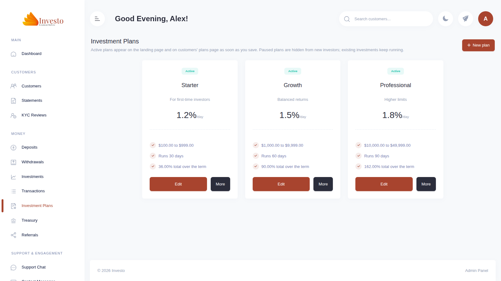

### 10.2 Markets

Markets are the prices customers see in the dropdowns on their dashboard, wallet and account pages.

1. Open **Market Controls** and scroll to the **Markets** card. Bitcoin, Ethereum and Gold are included.
2. Use the **Shown** switch to hide a market from customers. Use the arrows to change the order.

   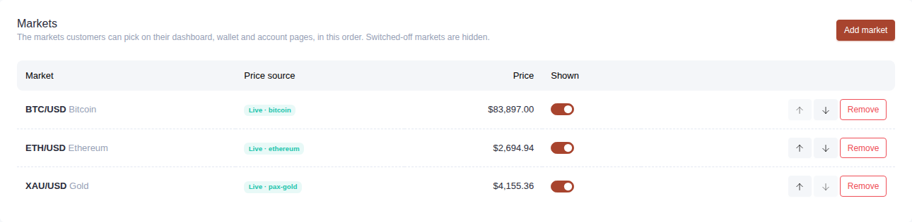

3. To add a market, click **Add market**:
   - **Live coin price:** type a coin name, click **Search** and pick the coin. Its real price updates every 5 minutes. Click **Add market**.
   - **Simulated pair:** for a pair with no free live price, for example EUR/USD. Type a symbol, a name and a starting price. The price moves on its own, and you can steer it with the price controls on the same page.

   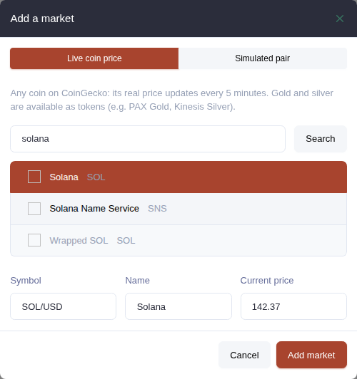

---

## Step 11: Connect your domain

### 11.1 Point your domain at Vercel

1. In Vercel, open your project, then **Settings > Domains**.
2. Type your domain, for example `northwind.co`, and click **Add**.
3. Vercel shows 1 or 2 DNS records. Add them at your domain registrar exactly as shown.
4. Wait until Vercel shows **Valid Configuration**. This usually takes 10 minutes to 1 hour.

### 11.2 Update the address everywhere

1. In Supabase, open **Authentication > URL Configuration**. Change **Site URL** to `https://northwind.co` and add `https://northwind.co/**` under **Redirect URLs**. Click **Save**.
2. In the admin panel, open **System > Integrations > Email (Resend)**. Change **Website address** to `https://northwind.co`. Click **Save**.
3. Open **System > Branding > Business details**. Type your domain in **Primary domain**. Click **Save changes**.

---

## Step 12: Before you launch

Check these 3 settings. The template turns some of them on so you can record demo videos.

1. **Social proof test notifications.** Open **Social Proof**. Turn **Test notifications** off. While it is on, signed-in customers see sample pop-ups.

   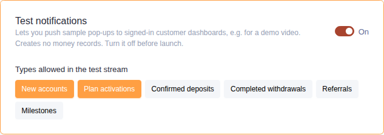

2. **Activity simulation.** Open **System > Activity Simulation** (super admins only). Turn it off. It is for demos only.
3. **Maintenance mode.** Open **System > Maintenance**. The switch at the top must show **Off**. While it is on, customers may be locked out, and deposits or withdrawals may be paused.

   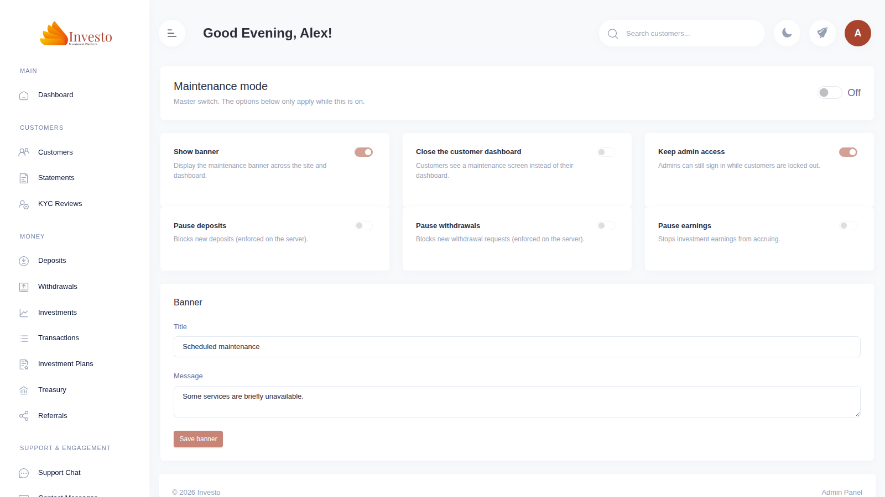

Then open **System > Setup Checklist** and click **Check again**. Every required step should show **Done**.

Finally, make one real test from start to end:

1. Open your site in a private browser window and create a customer account.
2. Make a small deposit and confirm it in **Money > Deposits**.
3. Invest in a plan.
4. Request a withdrawal. In **Money > Withdrawals**, click **Approve**, send the crypto, then click **Mark as paid** and paste the transaction hash.

If all 4 work, your site is ready for customers.

---

## Getting help

- **A page in the admin panel shows an error:** sign out, sign in again and repeat the action. If the error stays, open **System > Audit Logs** to see the last actions, and send the error message to support.
- **Emails do not arrive:** open **System > Integrations > Email (Resend)** and click **Send me a test email**. Then open **Logs** in Resend to see whether the email was sent.
- **Prices do not change:** repeat Step 4 and check that the `market-price-sync` function is **Active** in Supabase.
